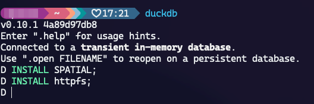

# Download ouverture data

I followed the instructions using duckdb as described here: https://docs.overturemaps.org/accessing-data/locally/#duckdb

## Setting up DuckDB

### Install the DuckDB command line:


### Install the Spatial extensions:

Run the duckdb CLI and install the spatial extensions:



### Define the bounding box:

We want to get the data for the state of Florida so we need to get its bounding box first. There are several methods to get it but I prefered to get it from QGIS. As a result, I got the following bouding box:

```
XMIN: -87.634643
XMAX: -79.974307
YMIN: 24.396308
YMAX: 31.000888
```

### Build the DuckDB query:

I followed the example described [here](https://docs.overturemaps.org/accessing-data/example-queries/#buildings-in-detroit) the build my query that get all buildings in the state of FL and run it in the DuckDB CLI:

```sql
-- Load the spatial extensions
LOAD spatial;
LOAD httpfs;
-- Set the AWS S3 region
SET s3_region='us-west-2';
-- Get the data into a GeoJSON file
COPY (
    SELECT 
    id,
    type,
    version,
    update_time,
    num_floors,
    level,
    class,
    -- We need to transform these columns as they are in a Struct format
    -- Otherwise, they will geneerate errors
    CAST(json_extract(sources, '$') AS STRING) AS sources,
    CAST(json_extract(names, '$') AS STRING) AS names,
    height,
    ST_GeomFromWKB(geometry) as geometry
    FROM read_parquet('s3://overturemaps-us-west-2/release/2024-03-12-alpha.0/theme=buildings/type=*/*', filename=true, hive_partitioning=1)
    WHERE bbox.minx > -87.634643
    AND bbox.maxx < -79.974307
    AND bbox.miny > 24.396308
    AND bbox.maxy < 31.000888
 ) TO '/path/to/folder/buildings_florida.geojson'
 WITH (FORMAT GDAL, DRIVER 'GeoJSON');
```

### Check the downloaded data:

There are exactly 8,379,304 features in the downloaded GeoJSON file.

First, we can partially check the raw content of the file with:

```sh
tail buildings_florida.geojson
```

That gives the following output:


I've translated it to Geopackage and loaded into QGIS the check for the spatial cover:


